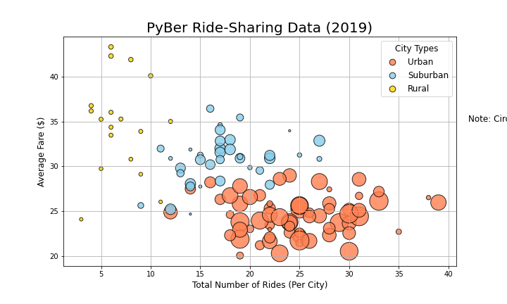
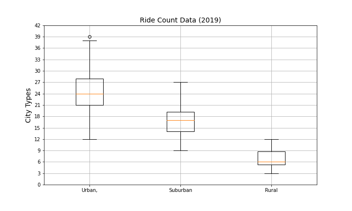
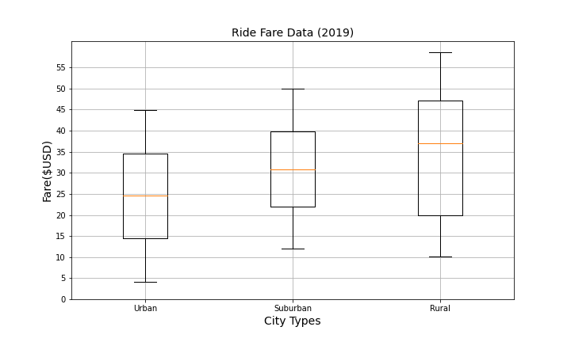
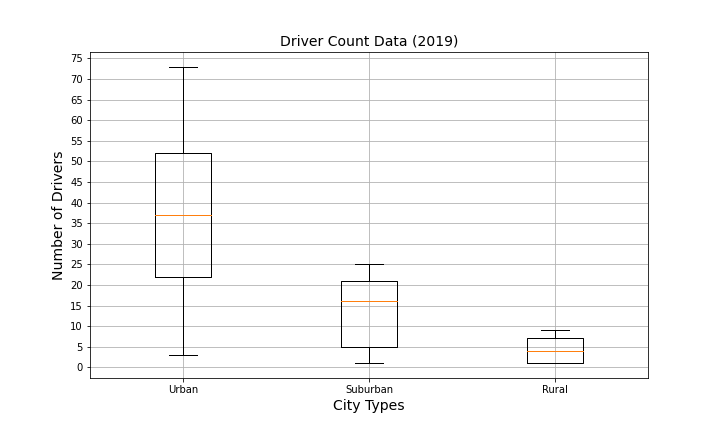
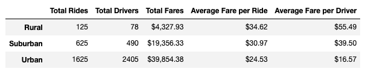
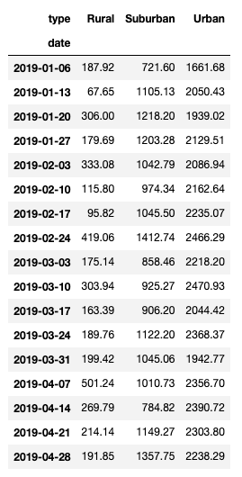
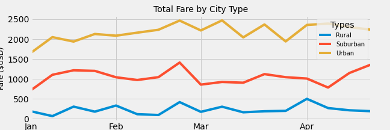

# PyBer Analysis


## Project Overview
______

PyBer is a ride-sharing app company that wants to increase accessibility to ride sharing services in underserved regions. PyBer provides services in three types of cities: urban, suburban, and rural. They wish to analyze the relationship between number of drivers and riders, and type of city, as well as the percentage of total fares, total riders and total drivers per type of city. PyBer utilizes Python, Pandas libraries as well as Jupyter notebooks and Matplotlib to analyze their data. 

### Objective
The analysis and visualizations requested by PyBer will help improve access to ride sharing services and evaluate the affordability in specific regions. 


### Resources
Data Source: ride_data.csv, city_data.csv


## Results
______
To meet the objectives, I began by merging the two datasets into one DataFrame called pyber_data_df. Using this DataFrame I created a bubble chart to showcase the average fare against the total number of drivers for each city type. 



Looking at this chart, we can observe that rural cities have a small number of drivers and the average fare prices are much higher. In contrast, urban cities have a great number of drivers, and the average fares are much lower. One hypothesis for this difference is that urban cities have a denser population, and this is the reason why PyBer has more drivers. Also, the average fare price in urban cities could be lower due to short-distance trips. However, it’s important to analyze further to determine if other contributing factors exist.      

- Average number of rides per city type

I determined the summary statistics on the number of rides per city and per type of city,  using the ``` describe()``` function on each of the following Series: ```urban_ride_count```, ```suburban_ride_count```,  and ```rural_ride_count```. Each Series showed the number of rides in each city. 
Urban cities had a mean of ~24.62 rides per city. Suburban cities had a mean of ~17.36, and rural cities had a mean of ~6.94. We can see the same results by plotting the data into a box-and-whisker plot. The following image is the ride count data chart.



The previous chart shows that there is an outlier in urban cities, a city that had 39 rides. The chart also highlights no outliers in suburban or rural cities, and the average number of rides in urban cities is 3 times higher than in rural cities. 

- Average fares per city type

The summary statistics for fare data gave us a mean of ~24.53 dollars for urban areas, a mean of ~30.97 for suburban areas and ~34.62 for rural areas. The following chart shows that average fares in rural cities are ~%41 higher than in urban cities. Also, the box plot shows that there is a wide range of fares per ride in rural cities, and fares are mostly higher. One assumption could be that distances are longer in rural cities; therefore, prices are higher.  




-	Average number of drivers 

The box plot for the average number of drivers shows that there’s a mean of 37 drivers in urban cities, a mean of 14 drivers in suburban cities, and a mean of 4 drivers in rural cities. Cities that are in the lower quartile, in rural areas, have as low as 1 driver per city.



We observe that on average, rural areas have inadequate service due to prices being higher than in urban and suburban areas and having very few drivers. The following pie chart shows that despite fares being higher per ride in rural areas, the total fares in rural areas make up only 6.8% of the sum of fares for all cities.


## Challenge

The final assignment for this project was to create a multiple-line graph showing the total weekly fares for each city type.  This final analysis will be used to make important decisions regarding the service that PyBer provides in all types of cities.
To complete this analysis, I created a new Summary DataFrame showing the Total Rides, Total Drivers, Total Fares, Average Fare per Ride and Average Fare per Driver.  This DataFrame shows something similar to what we’ve observed in the Total Fares pie chart.  Total fares in rural cities sum up to $4,327.93, and in urban cities, they sum up to $39,854.38. Total fares in urban cities are 8 times higher than in rural cities. 
The following image is the PyBer Summary Data Frame.


To better display data for PyBer’s decision-makers, I created a new DataFrame by resampling the current data to showcase weekly data from 2019-01-01 to 2019-04-29.  The following image shows the Weekly Fare Summary DataFrame.



Using this new DataFrame I created a multiple-line chart to illustrate the differences in ride-sharing services in the different city types.


## **Summary Statement**
_____

Looking at the multiple-line chart it’s clear that urban cities bring more revenue to PyBer. However, PyBer could apply different strategies to underserved cities.
First, they could make their fares accessible to customers in rural areas; they could be at least as accessible as in suburban areas to appeal to more customers. PyBer should also concentrate its efforts on hiring more drivers in rural and suburban areas to provide better service to these underserved areas. They could provide company incentive programs to their employees to keep their current staff and hire new people. Lastly, PyBer could make additional data analysis focusing on these underserved areas to determine if other causes are contributing to the differences in revenues. 
